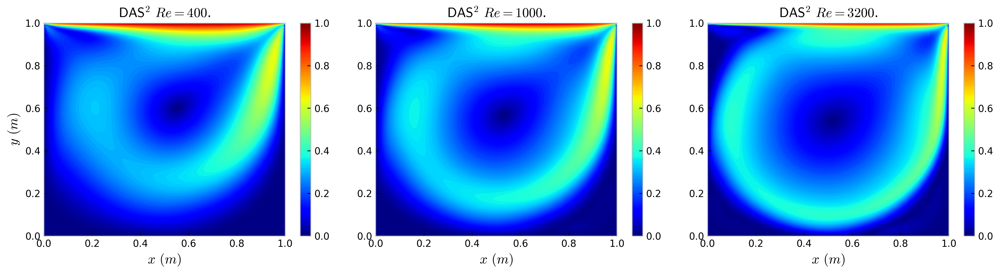

# DAS-2: Generalizing DAS for surrogate modeling of parametric differential equations
 Official implementation for the paper [Deep adaptive sampling for surrogate modeling without labeled data](https://arxiv.org/abs/2402.11283)

We propose a deep adaptive sampling approach for surrogate modeling of parametric differential equations without labeled data, i.e., DAS for surrogates ($\text{DAS}^2$).
We demonstrate the efficiency of the proposed method with a series of numerical experiments, including the operator learning problem, the parametric optimal control problem,
and the lid-driven 2D cavity flow problem with a continuous range of Reynolds numbers from 100 to 3200 (see the paper). 


# Requirements

PyTorch, 
Numpy, 
Scipy,
pyDOE


# Motivation
Surrogate modeling is of great practical significance for parametric differential equation systems. In contrast to classical numerical methods, using physics-informed deep learning-based methods to construct simulators for such systems is a promising direction due to its potential to handle high dimensionality, which requires minimizing a loss over a training set of random samples. However, the random samples introduce statistical errors, which may become the dominant errors for the approximation of low-regularity and high-dimensional problems.

Choosing a proper set of collocation points is crucial for solving low-regularity problems. Adaptive sampling is needed.


# Train
Operator learning
```bash
cd Operator_learning
python das_oplearning.py
```

Surrogate modeling for parametric optimal control
```bash
cd Optimal_control
python das_train.py
```

Surrogate modeling for the lid-driven cavity flow
```bash
cd Lid-driven_cavity_flow
python das_train.py
```




# Citation
If you find this repo useful for your research, please consider to cite our paper (arXiv, 2024)
```
@article{wang2024deep,
  title={Deep adaptive sampling for surrogate modeling without labeled data},
  author={Wang, Xili and Tang, Kejun and Zhai, Jiayu and Wan, Xiaoliang and Yang, Chao},
  journal={arXiv preprint arXiv:2402.11283},
  year={2024}
}
```
